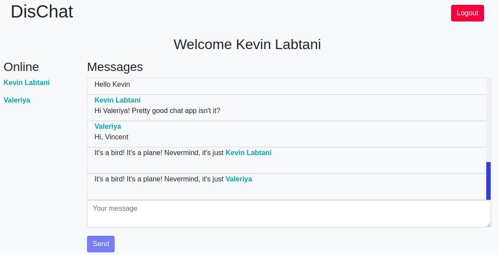

# Chat App

## Présentation du Projet

Projet créé le 03 Janvier 2020 dans le cadre de la formation Web Developer donnée par [BeCode](https://www.becode.org/), dans le but d'apprendre à utiliser Node.js, Express et socket.io

Le projet est réalisé sur base des [instructions données](https://github.com/becodeorg/CRL-Woods-2.15/blob/master/Projects/Chat/Node/chat.md).

Le projet est hébergé sur Heroku: [becode-dischat](https://becode-dischat.herokuapp.com/)

### **[Chat App](https://becode-dischat.herokuapp.com/)**

Le Projet consiste en une application de chat:

- Un système de login est implémenté avec [passport](http://www.passportjs.org/). Les utilisateurs doivent s'enregistrer et puis se logger avant d'accéder à l'application de chat. Chaque utilisateur doit avoir un nom (pseudonyme) et une adresse email unique.
- Les utilisateurs et messages sont validés et puis stockés dans une base de donnée NoSQL sur [MongoDB Atlas](https://www.mongodb.com/cloud/atlas) dans leur collections respectives.
- Les messages de chat envoyés persistent entre sessions.
- Une liste des utilisateurs actuellement connectés est disponible sur la page de chat.

## Contributeurs

- [**Vincent Bouton**](https://github.com/Vincent-bouton)
- [**Valeriya Kozlova**](https://github.com/ValeriyaKozlova)
- [**Kevin Labtani**](https://github.com/kevin-labtani)

## Langages et technologies

- JavaScript
  - [node.js](https://nodejs.org/en/)
  - [express](https://expressjs.com/)
  - [socket.io](socket.io)
  - [EJS](https://ejs.co/)
- MongoDB
  - [Mongoose](https://mongoosejs.com/)
- Bootstrap

* [x] HTML validated by [W3C Validator](https://validator.w3.org/)
* [x] JavaScript formatted with [Prettier](https://prettier.io/)

## Progression

Projet terminé le 10 Janvier 2020.

## Remerciements

- [BeCode](https://www.becode.org/) pour la formation.
- [Arnaud Duchemin](https://github.com/Cervant3s) pour le coaching.
- La promotion **CRL-Woods-2.15** pour l'aide et le support.
